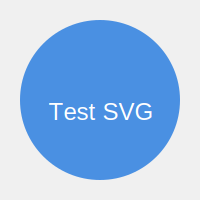

# Welcome to my first blog post!

This is a paragraph with an [[annotated word]]. When you click on it, it will open a Google search for "annotated word".

Here's an SVG image:

This image is stored in the assets folder.